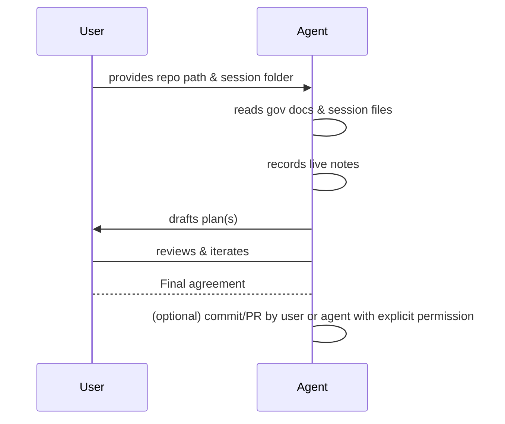

# Vibe Planning Process

This document describes the project's "vibe planning" process — a lightweight, collaborative planning workflow between a
human user and the AI agent.

## Overview

- "Vibe planning" is an iterative planning session where the user supplies high-level goals and constraints and the
  agent acts as Principal Architect to produce a plan.
- The agent records live notes and produces a short summary after each session.

## Key Artifacts

- Session folder: `.ai/chat-sessions/<session-id>/`
  - `agent-instructions.md` — user-provided instructions for the session (template:
    `.ai/templates/agent-instructions.md`).
  - `agent-notes.md` — running notes recorded by the agent (template: `.ai/templates/agent-notes.md`).
  - `agent-summary.md` — final session summary (template: `.ai/templates/agent-summary.md`).
  - `agent-override.md` (optional) — one-shot overrides for the session.

## Workflow

1. User starts a session and provides the repository path and session folder name in chat.
2. Agent reads governing documents and previous session artifacts.
3. Agent reads `agent-instructions.md` (if present) and `agent-override.md` (if present) from the session folder.
4. Agent records `agent-notes.md` live as the session progresses.
5. When the session ends and the plan is agreed, the agent produces `agent-summary.md` and (with permission) may
   commit/push the final plan and open a PR.

## ADRs

- If a decision deviates from governing documents, the agent drafts an ADR and records it in `docs/governance/ADR.md` as
  a plain Markdown heading. The ADR remains in Proposed status until the user explicitly accepts it.

## Example Session

- Session ID: `2025-11-01-01`
- Goal: Decide on project scaffolding for a new Go microservice.

1. User places `agent-instructions.md` in `.ai/chat-sessions/2025-11-01-01/` with the Goal, Background, Constraints, and
   Deliverables.
2. Agent reads governing docs, previous sessions, and the session instructions.
3. Agent records live notes into `agent-notes.md` as the session progresses.
4. Agent drafts a human-friendly plan `plan.md` and a machine-friendly `plan.yaml` in the local workspace.
5. User and agent iterate until the plan is agreed.
6. User authorizes the agent to commit and open a PR, or the user commits the final plan themselves. Any ADRs resulting
   from decisions are added to `docs/governance/ADR.md`.

## Flow Diagram

