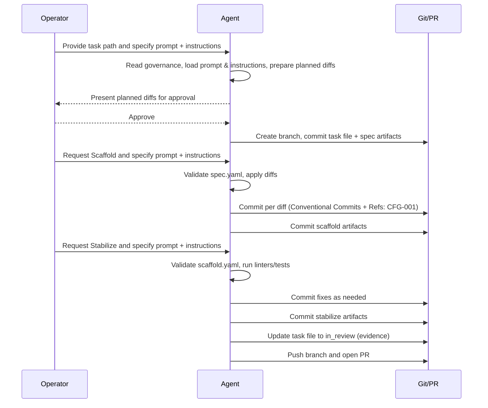

# The 3‑Pass Plan: Spec → Scaffold → Stabilize

This document explains how to execute our three-pass workflow end-to-end for any task defined under
`Tasks/<TASK-ID>.yaml`. It describes the role of prompts vs. instructions, branch and commit conventions, required
artifacts and schemas, and provides a concrete example.

Audience: Operators, contributors, and AI agents running our prompts.

## Overview

- Pass 1 — Spec: Design the change safely. Produce planned diffs and write spec artifacts for handoff. Do not mutate
  source yet.
- Pass 2 — Scaffold: Apply the planned diffs. Commit minimal, logical changes that implement the spec. Produce scaffold
  artifacts.
- Pass 3 — Stabilize: Run checks, fix issues, and prepare the branch for review. Update the task to `in_review`, commit
  evidence, and open a PR.

Artifacts are written under `.ai/task-artifacts/<TASK-ID>/` and validated with JSON Schemas in `schemas/`.

## Prompts vs. Instructions (what to run)

- Prompts (what to do):
  - Spec: `.github/prompts/001-spec-pass.md`
  - Scaffold: `.github/prompts/002-scaffold-pass.md`
  - Stabilize: `.github/prompts/003-stabilize-pass.md`

- Instructions (how to do it, reusable policy):
  - Spec: `.github/instructions/001-spec-pass-instructions.md`
  - Scaffold: `.github/instructions/002-scaffold-pass-instructions.md`
  - Stabilize: `.github/instructions/003-stabilize-pass-instructions.md`

Use: When invoking a prompt with your AI agent, also load the matching instruction file for consistent behavior across
tasks.

## Conventions you must follow

- Branch naming: `<type>/<task-id>-<slug>` (e.g., `feat/CFG-001-add-config`). One slash only. Types: `feat`, `bugfix`,
  `chore`, `refactor`, `docs`, `test`.
- Conventional Commits: `type(scope): subject` where `scope` reflects the slice/component being changed (e.g., `docs`,
  `ci`, `governance`, `schemas`, `templates/java`, `examples`). Reference the Task ID in the commit footer using
  `Refs: <TASK-ID>`. Example:

  ```
  feat(schemas): add stabilize artifact schema
  
  Refs: CFG-001
  ```
- Task status transitions: `pending` → `in_progress` → `in_review` → `done`.
- Artifacts directory: `.ai/task-artifacts/<TASK-ID>/`.
- Schemas:
  - Spec: `schemas/spec-artifact.schema.v0.1.json`
  - Scaffold: `schemas/scaffold-artifact.schema.v0.1.json`
  - Stabilize: `schemas/stabilize-artifact.schema.v0.1.json`
- Evidence format (in `Tasks/<TASK-ID>.yaml`): when updating `evidence.testSummary`, use the object shape described in
  `schemas/task-file.schema.v0.1.json`. Evidence may also include `timestamp` (ISO-8601) and `branchName` per schema
  v0.1.

## Pass 1 — Spec (design)

Goal: Produce a precise, reviewable plan with zero source edits. Write artifacts for scaffold to consume.

Files to use:

- Prompt: `.github/prompts/001-spec-pass.md`
- Instructions: `.github/instructions/001-spec-pass-instructions.md`

What happens (high level):

1) The agent reads governing docs (Goals/Conventions/System) and asks you for the exact task file path (e.g.,
   `Tasks/CFG-001.yaml`).
2) The agent summarizes acceptance criteria and proposes planned diffs: specific file paths, change markers, and
   justifications.
3) The agent writes artifacts (by default):
  - `.ai/task-artifacts/<TASK-ID>/spec.yaml` (machine-readable; validated by `schemas/spec-artifact.schema.v0.1.json`)
  - `.ai/task-artifacts/<TASK-ID>/planned-diffs.md` (human-friendly)
4) The agent waits for your approval before any branch/commit.

Upon approval only:

- Create the branch `<type>/<task-id>-<slug>`.
- Update `Tasks/<TASK-ID>.yaml` status to `in_progress` and write the spec artifacts; commit them together as the FIRST
  commit on the new branch. Optionally add a short note in the task file `notes` field; evidence fields such as
  `branchName` and `timestamp` may be populated per schema.

Output of Spec:

- Planned diffs in chat.
- `spec.yaml` + `planned-diffs.md` under `.ai/task-artifacts/<TASK-ID>/`.
- First branch commit (after approval) that contains the task file status change and spec artifacts.

## Pass 2 — Scaffold (implement)

Goal: Apply the planned diffs and capture exactly what was changed.

Files to use:

- Prompt: `.github/prompts/002-scaffold-pass.md`
- Instructions: `.github/instructions/002-scaffold-pass-instructions.md`

What happens:

1) The agent validates `.ai/task-artifacts/<TASK-ID>/spec.yaml` against `schemas/spec-artifact.schema.v0.1.json` and
   confirms the task branch is checked out.
2) The agent applies `planned_diffs` in order. For each change, it stages and commits with a Conventional Commit (scope
   reflects the component path, not the Task ID). Example:

  - `feat(schemas): add task schemas — add placeholders`

    Include the Task ID in the footer:
       ```
       Refs: CFG-001
       ```

3) The agent writes scaffold artifacts:

  - `.ai/task-artifacts/<TASK-ID>/scaffold.yaml` (machine-readable; validated by
    `schemas/scaffold-artifact.schema.v0.1.json`)
  - `.ai/task-artifacts/<TASK-ID>/scaffold-report.md` (human-friendly)

4) The agent commits the scaffold artifacts using a Conventional Commit with appropriate scope (e.g.,
   `chore(artifacts): add scaffold artifacts`) and includes the task reference in the footer (`Refs: <TASK-ID>`).

Output of Scaffold:

- A series of Conventional Commits applying planned diffs.
- `scaffold.yaml` + `scaffold-report.md` committed to the branch.

## Pass 3 — Stabilize (verify and prepare PR)

Goal: Run checks, fix issues, record results, update task file to `in_review`, and open a PR.

Files to use:

- Prompt: `.github/prompts/003-stabilize-pass.md`
- Instructions: `.github/instructions/003-stabilize-pass-instructions.md`

What happens:

1) The agent validates `.ai/task-artifacts/<TASK-ID>/scaffold.yaml` (and optionally re-validates `spec.yaml`).
2) The agent runs checks:
  - This repository: prioritize linters/static analysis (since it may not build tests).
  - For code templates: run lint → unit tests → integration tests → quality gates (coverage), as applicable.
3) The agent performs up to a few small fix iterations. Each fix is a Conventional Commit (`fix(...)`, `refactor(...)`,
   etc.).
4) The agent writes stabilize artifacts and validates the YAML:
  - `.ai/task-artifacts/<TASK-ID>/stabilize.yaml` (machine-readable; `schemas/stabilize-artifact.schema.v0.1.json`)
  - `.ai/task-artifacts/<TASK-ID>/stabilize-report.md` (human-friendly)
5) The agent updates `Tasks/<TASK-ID>.yaml`:
  - `status: in_review`
  - `evidence`: include `commit` (SHA), optional `timestamp` and `branchName`, plus `testSummary` as an OBJECT per
    `schemas/task-file.schema.v0.1.json` (for this repo, record linter results in `notes` and zeroed test counts).
    Include optional `ciRunUrl` and `prUrl` when available.
6) The agent commits the task file: `chore(<TASK-ID>): update task status to in_review`.
7) The agent pushes the branch and opens a PR to the chosen base (often `main` or `develop`). Include links to
   artifacts.

Output of Stabilize:

- Passing checks (or documented exceptions) and a PR ready for review.
- `stabilize.yaml` + `stabilize-report.md` committed to the branch.
- Task file set to `in_review` with structured evidence.

## Example: Process `Tasks/CFG-001.yaml`

1) Spec

- Run the Spec prompt with the Spec instructions loaded. Provide `Tasks/CFG-001.yaml` when asked.
- Review the planned diffs in chat. Approve.
- Branch: `feat/CFG-001-add-config`
- First commit includes:
  - `Tasks/CFG-001.yaml` updated to `in_progress` with evidence (branch + timestamp)
  - `.ai/task-artifacts/CFG-001/spec.yaml`
  - `.ai/task-artifacts/CFG-001/planned-diffs.md`
  - Commit message example:

    Subject and footer using Conventional Commits with Refs footer (scope reflects component):

    - Subject: `chore(artifacts): start task branch and add spec artifacts`
    - Footer: `Refs: CFG-001`

2) Scaffold

- Run the Scaffold prompt with Scaffold instructions.
- Agent validates `spec.yaml` and applies diffs, committing per change, e.g.:
  - `feat(schemas): add scaffold schema — applied diffs`
  - `refactor(docs): clarify three-pass plan`
  - Each commit footer includes the Task ID:
    ```
    Refs: CFG-001
    ```
- Agent writes and commits:
  - `.ai/task-artifacts/CFG-001/scaffold.yaml`
  - `.ai/task-artifacts/CFG-001/scaffold-report.md`
  - Commit message: `chore(artifacts): add scaffold artifacts` with `Refs: CFG-001` in the footer.

3) Stabilize

- Run the Stabilize prompt with Stabilize instructions.
- Agent validates `scaffold.yaml`, runs linters, performs small fixes as needed:
  - `fix(docs): address lint warnings in three-pass plan`
- Agent writes and validates:
  - `.ai/task-artifacts/CFG-001/stabilize.yaml`
  - `.ai/task-artifacts/CFG-001/stabilize-report.md`
- Agent updates `Tasks/CFG-001.yaml`:
  - `status: in_review`
  - `evidence` with commit SHAs and a `testSummary` object (e.g., zero tests, notes about linters)
- Agent commits: `chore(tasks): update task status to in_review` with `Refs: CFG-001` in the footer.

## Sample Session (Spec → Scaffold → Stabilize)

Below is a condensed, illustrative exchange (operator ↔ agent) with key shell commands. Note: use multiple `-m` flags or
a file/STDIN to ensure actual linefeeds in commit messages; do not embed `\n` literals.

```text
Operator: Run the Spec pass using the following prompt and instructions.
  - Prompt: .github/prompts/001-spec-pass.md
  - Instructions: .github/instructions/001-spec-pass-instructions.md
  The task file is at Tasks/CFG-001.yaml.
Agent: Loading governance docs and the specified spec prompt/instructions. Summarizing acceptance criteria... Proposing planned diffs. Do you approve?
Operator: Approved. Use branch feat/CFG-001-add-config.
Agent: Creating branch, updating Tasks/CFG-001.yaml to in_progress, writing spec artifacts, committing as first commit.

# Commands (agent)
$ git checkout -b feat/CFG-001-add-config
$ git add Tasks/CFG-001.yaml .ai/task-artifacts/CFG-001/spec.yaml .ai/task-artifacts/CFG-001/planned-diffs.md
$ git commit -m "chore(artifacts): start task branch and add spec artifacts" -m "Refs: CFG-001"

Operator: Proceed to Scaffold using these files.
  - Prompt: .github/prompts/002-scaffold-pass.md
  - Instructions: .github/instructions/002-scaffold-pass-instructions.md
Agent: Validating spec.yaml; applying diffs; committing each change.

# Example commits (agent)
$ git add path/to/fileA
$ git commit -m "feat(schemas): add new config schema — initial" -m "Refs: CFG-001"
$ git add path/to/fileB
$ git commit -m "refactor(docs): tighten language in conventions" -m "Refs: CFG-001"

Agent: Writing scaffold artifacts and committing.
$ git add .ai/task-artifacts/CFG-001/scaffold.yaml .ai/task-artifacts/CFG-001/scaffold-report.md
$ git commit -m "chore(artifacts): add scaffold artifacts" -m "Refs: CFG-001"

Operator: Proceed to Stabilize using these files.
  - Prompt: .github/prompts/003-stabilize-pass.md
  - Instructions: .github/instructions/003-stabilize-pass-instructions.md
Agent: Validating scaffold.yaml; running linters; fixing a warning; committing fix.

$ git commit -am "fix(docs): remove trailing spaces in three-pass plan" -m "Refs: CFG-001"

Agent: Writing stabilize artifacts; validating stabilize.yaml; updating task file; opening PR.
$ git add .ai/task-artifacts/CFG-001/stabilize.yaml .ai/task-artifacts/CFG-001/stabilize-report.md
$ git commit -m "chore(artifacts): add stabilize artifacts" -m "Refs: CFG-001"
$ git add Tasks/CFG-001.yaml
$ git commit -m "chore(tasks): update task status to in_review" -m "Refs: CFG-001"
$ git push -u origin feat/CFG-001-add-config
$ gh pr create --fill --base main --head feat/CFG-001-add-config
```

### Diagram (Mermaid)


